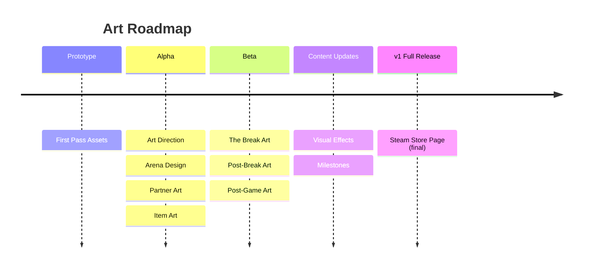

# Volley Vendetta - Art Roadmap

## Prototype

**First Pass Assets** produces placeholder-quality-but-complete visuals for the itch.io demo: paddle sprites, ball, arena, shop UI, Martha's paddle, and basic item icons. Not final art; enough that the game looks intentional. Replaced in Alpha.

## Alpha

**Art Direction** establishes the visual rules everything else follows: style guide, colour palette, typography, and overall aesthetic.

**Arena Design** works out all arenas including background and foreground layers. The visual space the game lives in.

**Partner Art** ships with each partner: sprite, expressions, animation states (idle, hit, miss). Each partner is a complete art package.

**Item Art** ships with each item: visual representation in the shop and kit. Ball art is part of item art where relevant.

## Beta

**The Break Art** designs and produces the reveal image in a different art style. Rawer, less constructed. The only moment the game drops its aesthetic.

**Post-Break Art** covers visual changes for the post-break phase: expression variants, shifted palettes.

**Post-Game Art** produces the visual shift for post-game: palette, lighting, or register change.

## Content Updates

**Visual Effects** adds hit sparks, streak glow, and miss reactions.

**Milestones** produces badge art for the milestone collection.

## v1 Full Release

**Steam Store Page (final)** is the full Steamworks treatment: capsule images, screenshots, trailer, and submission for review.
