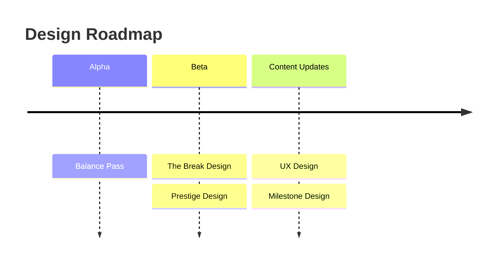

# Volley Vendetta - Design Roadmap

## Alpha

**Balance Pass** tunes item costs, the ball scaling curve, and time-to-milestones. Can only be done once the full item set and partner roster are in.

## Beta

**The Break Design** is the prerequisite for everything else in Beta. Defines the specific thing revealed, the art direction brief for the reveal image, and the design of the post-break state.

**Prestige Design** specifies the full prestige system: what resets, what carries over, and how prestige differs across phases.

## Content Updates

**UX Design** defines how the player moves through the game: flows, navigation, idle transitions, and shop UX.

**Milestone Design** defines the full badge set: what triggers each one, what it rewards, and how the collection UI works.
